# Módulo 1 - Princípios de Desenvolvimento de Software

As anotações aqui apresentadas foram desenvolvidas com base no Bootcamp "Geração Tech Unimed-BH", da plataforma de estudos **[DIO](https://web.dio.me/home)**.

## Curso 1 - Introdução à Programação e Pensamento Computacional

//Primeiros passos para começar a programar

**Mentora: Juliana Mascarenhas**

Objetivo Geral  

* Entender o que significa pensar computacionalmente, o que pode ser aplicado a qualquer área do conhecimento.
* Assim, portanto, ser capaz de resolver qualquer problema de uma maneira mais objetiva e eficiente.

Percurso

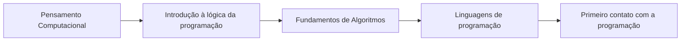

---

[1.1 Pensamento Computacional](#11-pensamento-computacional)

[1.2 Introdução à lógica de programação](#12-introdução-à-lógica-de-programação)

[1.3 Fundamentos de Algoritmos](#13-fundamentos-de-algoritmos)

[1.4 Linguagens de Programação](#14-linguagens-de-programação)

[1.5 Primeiro contato com a Programação](#15-primeiro-contato-com-a-programação)

---

### 1.1 Pensamento Computacional

* Etapa 1 - Introdução ao Pensamento Computacional
* Etapa 2 - Habilidades compelementares
* Pilares
  * Decomposição
  * Padrões
  * Abstração
  * Algoritmos
* Etapa 7 - Estudo de caso conceitual: perdido
* Etapa 8 - Estudo de caso aplcado: soma de um intervalo
* Etapa 9 - Estudo de caso aplicado: adivinhe um número

#### 1.1.1 Introdução

Está atrelado, mas não se restringe, ao meio computacional (ciências exatas e computação).

>É um “processo de pensamento envolvido na expressão de soluções em passos computacionais ou algoritmos que podem ser implementados no computador” (Aho, 2011; Lee, 2016)

* O pensamento computacional é sistemático e eficiente na formulação e resolução de problemas, e deve ser utilizado de forma que um humano e uma máquina sejam capazes de resolver.
* Não se trata de uma disciplina acadêmica, mas sim uma habilidade generalista, que pode ser utilizada em diversos campos do conhecimento (matemática, escrita, leitura...)
  * Ex. Na escrita, dado o contexto, determina-se as partes principais do texto e cria-se uma estruturação de maneira que ele fique mais coerente e objetivo.

O pensamento computacional está baseado em 4 pilares:

**Decomposição**: Dividir um problema compelxo em subproblemas mais simples.
>
>Ex. Receita de bolo
>
>* Problema: BOLO
>* BOLO = massa + recheio + cobertura
>
Não há ordem para resolver os subproblemas, mas na hora de montar, sim. É necessário coesão!

**Reconhecimento de padrões**: Identificar padrões ou tendências (similaridades ou diferenças entre os problemas).

**Abstração**: Extrapolar o conceito de um problema particular para uma forma generalista.

>Ex. Quero  saber a circunferência de uma caixinha de som cilindrica. É possível medir, mas a solução será aplicável apenas àquele problema. Se parametrizada a informação, pode ser utilizada para qualquer círculo (P = π*2r)

**Design de algoritmos**: Automatização da resolução de problemas. Definir passo a passo a solução.

O pensamento computacional une o melhor dos dois mundos: as **habilidades humanas** e os **recursos computacionais**.

* O ser humano é ótimo em detectar padrões (naturalmente), processo que pode ser ensinado à máquina.

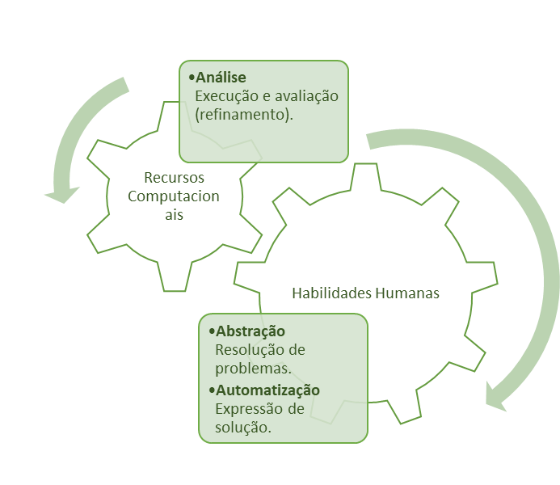

Onde o pensamento computacional pode ser utilizado?

* Química: Aperfeiçoamento de reações químicas pela utilização de algoritmos, através da identificação de químicos
* Engenharia: Simulações de aeronaves executadas via software no lugar do túnel de vento

No fim, ficamos com o processo abaixo, que se repete em um ciclo virtuoso, não necessariamente com todas as fases.

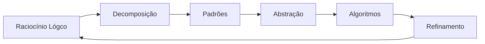

#### 1.1.2 Habilidades Complementares

* Raciocínio Lógico
* Aperfeiçoamento

Tais habilidades estão atreladas ao tipo de pensamento que se deve desenvolver ao longo do curso.

**Raciocínio Lógico** é uma forma de pensamento estruturado, ou raciocínio, que permite encontrar a conclusão ou determinar a resolução de um problema. Esta é uma habilidade de treinamento (quanto mais vezes for utilizada, mais fácil fica).

Pode ser dividido em 3 categorias:

* Indução;
  * Surge de um fenômeno observado repetidas vezes, que dá origem a leis e teorias. *Ciências experimentais*
* Dedução;
  * O inverso da indução. A partir de leis e teorias, faz-se previsões ou explicações sobre um fenômeno. *Ciências exatas*
* Abdução.
  * A partir de uma conclusão, faz-se uma premissa (Ex. A grama está molhada, logo deve ter chovido). *Processo investigativo*

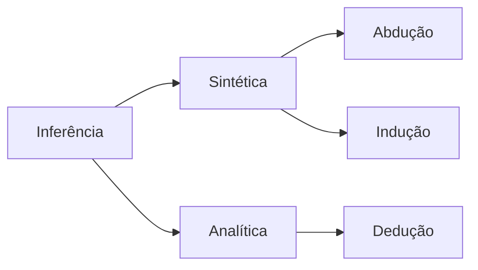

>Resolva o seguinte exemplo: Um pai, mãe e seu casal de filhos estão sentados em uma mesa. Os homens se chamam Roberto e Sérgio, as mulheres, Teresa e Fernanda. Sabe-se que o pai está à frente de Fernanda e o filho, a esquerda. Também se sabe que a mãe está do lado direito do Sérgio.

<details>

  <summary>Solução</summary>

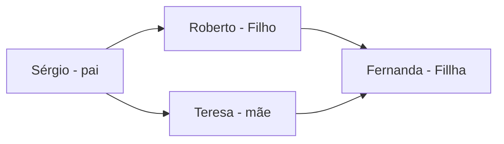

</details>

**Aperfeiçoamento**, por sua vez, é o ato de aperfeiçoar, encontrar uma solução eficiente e otimizar processor de forma a melhorar o uso de recursos, mas também melhorar códigos e algoritmos ao simplificar linhas de códigos e desenvolver funções bem definidas.

#### 1.1.3 Pilares: Decomposição

>“If you can’t solve a problem, then there’s an easier problem you can solve: find it” (George Polya, professor e matemático)
>
>>Se você não consegue revolver um problema, tem um problema mais fácil de ser resolvido: encontre-o.

A decomposição é o primeiro passo da resolução de problemas dentro do conceito de pensamento computacional.

“Dado um problema complexo, devemos quebra-lo em problemas menores e, portanto, mais fáceis e gerenciáveis.”

Estratégias

* Análise: Processo de quebrar e determinar partes menores e gerenciáveis;
* Síntese: Combinar os elementos recompondo o problema original;
  * Consiste em reunir os elementos distintos em um único grande elemento, em um processo de reconstrução, fundindo-os de maneira coerente.

A ordem de execução desses problemas menores pode ser SEQUENCIAL (dependência entre as tarefas) ou PARALELA (+ eficiência, - tempo), a depender do contexto.

A decomposição, assim como o pensamento lógico, é uma habilidade de treinamento (quanto mais vezes for utilizada, mais fácil fica).

Há maneiras distintas de decompor o mesmo problema.

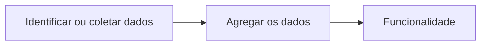

>Ex. 1: Cozinhar
>
>1. Identificar os ingredientes
>2. Determinar as etapas (sequencial ou paralelo)
>3. Executar cada etapa
>4. Agregar para finalizar (recompor coerência)

>Ex. 2: Movimentos de um avatar

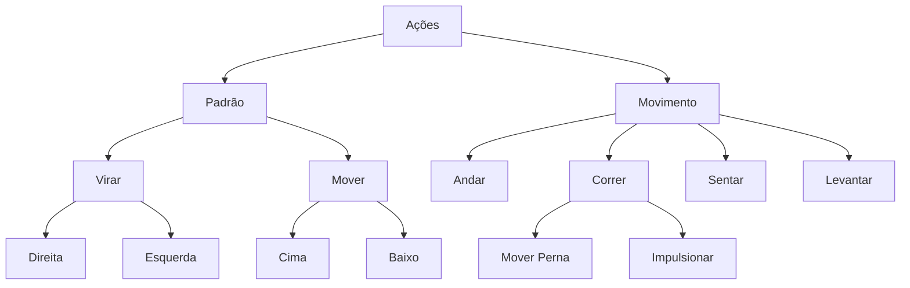

Graças a decomposição, se for necessário realizar uma mudança na função, será pontual.
>Ex. PADRÃO depende de virar e mover. VIRAR depende de DIREITA e ESQUERDA. Ao alterar DIREITA ou ESQUERDA, VIRAR e PADRÃO são automaticamente atualizados.

#### 1.1.4 Pilares: Padrões

Quando se fala de reconhecimento de padrões tem-se um modelo base, de estrutura variante, e repetição.

>Ex. cadeira: existe um modelo base (um objeto com características que nos permitem sentar), massa estrutura pode variar, (tal qual o tamanho do encosto, tamanho do assento, design, etc).

No ambiente computacional, detectamos padrões a partir de similaridades e diferenças.

Ao determinar padrões, é possível generalizar um problema para que a solução obtida se aplique a mais de um cenário
>(Ex. da caixinha de som, no item 1.1.1).

Como?

* Classes
* Categorias
  * Dependem de um domínio (tipo de media)

Os seres humanos reconhecem padrões a partir de:

* Grau de similaridade;
* Comparação de grupos conhecidos com o objeto desconhecido.

E o computador? Por comparação.

Entretanto, o computador não vai aprender a partir de abstração. É preciso criar uma representação dos atributos desejados, que serão, então, armazenados. A partir daí, tem-se as regras de decisão.

* A tem as características X, Y e Z, que pertencem a classe J. Provavelmente, A pertence a classe J.

Aplicações:

* Classificação de dados;
* Reconhecimento de imagem;
* Reconhecimento de fala;
* Análise de cenas;
* Classificação de documentos...

O reconhecimento de padrões está em várias áreas do conhecimento. Machine Learning, Redes Neurais, Inteligência Artificial e Ciência de Dados são apenas alguns exemplos.

#### 1.1.5 Pilares: Abstração

* Abstrair: Observar um ou mais elementos, avaliando as características e propriedades em separado;
* Abstração: Processo intelectual de isolamento de um objeto da realidade;
* Generalizar: Tornar geral, amplo, extenso.

A abstração, portanto, configura-se e identificar os elementos principais de determinado objeto, extrapolá-lo para o mundo abstrato de forma a generalizá-lo.

Generalização, na lógica, é a operação intelectual que consiste em reunir numa classe geral, um conjunto de seres ou fenômenos parecidos.

Como classificar os dados?

* Características;
* Pontos essenciais;
* Generalizar em detrimento dos detalhes.

A partir desse passo a passo, obtém-se uma representação do fenômeno analisado.

>Ex. de abstração: Limpeza no terreno.
>
>Suponhamos que um fazendeiro queira limpar o seu terreno das árvores. Nesse caso, o tipo de árvore (se é frutífera ou não, etc) não faz diferença, mas a distância entre elas e a própria casa, sim. A partir da análise das distâncias entre cada árvore no terreno, é possível determinar a rota ótima para cortá-las.

#### 1.1.6 Pilares: Algoritmo

O computador não opera sozinho, necessita receber instruções para realizar tarefas.

* As instruções são utilizadas no processamento dos dados na máquina. O computador recebe, manipula e armazena dados.
  
Os programas fornecem instruções, o passo a passo das atividades que o computador vai realizar. Este processo de resoluções por algoritmos é denominado “step by step”.

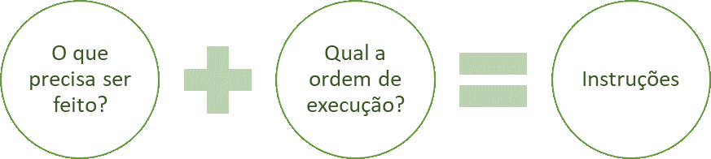

Para desenvolver um programa, o primeiro passo é analisar, ou seja, estudar e definir os dados de entrada e saída. Em seguida, formula-se o algoritmo (que deve ser entendido tanto pelo humano como pela máquina). Por fim, ocorre a codificação, em que o dev codifica o algoritmo de acordo com a linguagem de programação escolhida.

Um algoritmo pode ser construído a partir de

* **Narrativa**, por meio da utilização de linguagem natural. O problema é que há diversas interpretações possíveis;
* **Fluxograma**, através da utilização de símbolos pré-definidos. É simples, mas exige conhecimento prévio a estrutura e símbolos.
* **Pseudocódigo**, pelo portugol, por exemplo. É um meio termo entre programação e linguagem natural.

<details>

  <summary>Dica: Algoritmo</summary>

Um vídeo para entender o que é um algoritmo.

"**[THIS 'EXACT INSTRUCTIONS CHALLENGE' IS SO HILARIOUS](https://www.youtube.com/watch?v=Ct-lOOUqmyY)**", do canal Now I've Seen Everything.

</details>

#### 1.1.7 Estudo de caso conceitual: Perdido

#### 1.1.8 Estudo de caso aplicado: Soma de Intervalo

#### 1.1.9 Estudo de caso aplicado: Adivinhe o Número

---

### 1.2 Introdução à lógica de programação

#### 1.2.1 O que é lógica

A lógica tem o objetivo de solucionar um problema, uma questão, que pode ter numerosas soluções.

* Um “problema é uma questão que foge a uma determinada regra, ou melhor, é um desvio de percurso, o qual impede de atingir um objetivo com eficiência e eficácia”.

Assim, uma definição forma de lógica pode ser:

>“Parte da filosofia que trata das formas do pensamento em geral (dedução, indução, hipótese e inferência, por exemplo) e das operações intelectuais que visam a determinação do que é verdadeiro ou não.”

Na computação, a lógica é a “organização e planejamento das instruções, assertivas em um algoritmo, a fim de viabilizar a implantação de um programa.”

Os seres humanos podem prever comportamentos, utilizando-a de maneira intuitiva. O mesmo não ocorre com os computadores

#### 1.2.2 Técnicas de Lógica de programação

>Ex. Suponha a construção de um prédio. Primeiro, o arquiteto formula a planta baixa. Em seguida, o engenheiro elabora o projeto da construção e, por fim, o planejamento define as estratégias para execução do projeto.

A primeira técnica, portanto, é a **linear**. Um modelo tradicional, que não tem vínculo com estruturas hierárquicas, e pode ser utilizada na programação de computadores.

* É um modelo de desenvolvimento e resolução de problemas.

A técnica linear é a execução sequenciada de uma série de operações com recursos limitados e uma única dimensão.

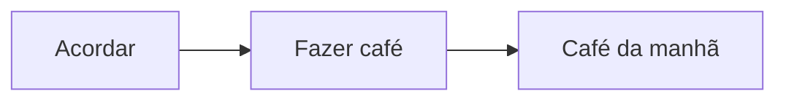

Outra técnica é denominada **estruturada**. Trata-se da organização, disposição e ordem dos elementos essenciais que compõem um corpo (concreto ou abstrato).

Dado o processamento de dados como exemplo, temos como objetivo da técnica estruturada:

* Escrita (de programas);
* Entendimento;
* Validação;
* Manutenção.

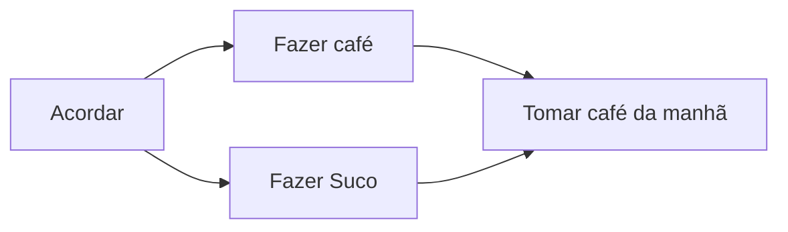

A **técnica modular** configura-se por um amontoado de partes independentes controladas por um conjunto de regras.

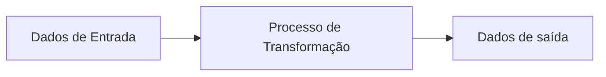

A partir do processo descrito acima (padrão da técnica modular) é possível:

* Simplificação;
* Decompor o problema;
* Verificação do módulo (cada módulo tem seu próprio conjunto de regras).

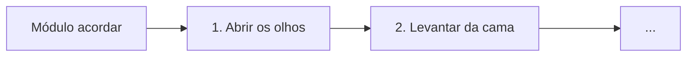

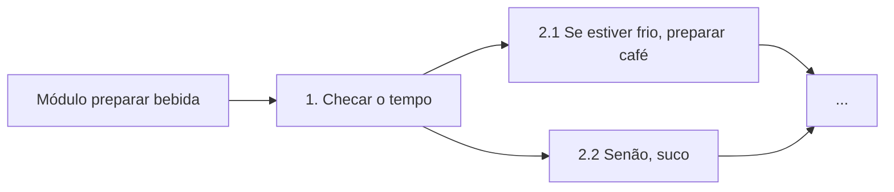

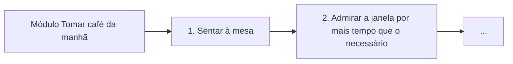

---

### 1.3 Fundamentos de Algoritmos

* Etapa 1 - Tipologia e variáveis
* Etapa 2 - Instruções Primitivas
* Etapa 3 - Estruturas condicionais  operadores
* Etapa 4 - Estruturas de Repetição
* Etapa 5 - Vetores e matrizes
* Etapa 6 - O que são funções
* Etapa 7 - Instruções de entrada/saída

#### 1.3.1 Tipologias e Variáveis

Qual a função do computador?

Executar as informações passadas a ele, que são compostas de **dados** (objetos de manipulação) e **instruções**.

Os dados são tratados e processados, e podem ser categorizados como:

* Numéricos
  * Inteiros
  * Reais
* Caracteres
* Lógicos (Booleano)
  * Verdadeiro (1)
  * Falso (0)

Nos programas, os dados exemplificados acima são representados por variáveis.Uma variável é um parâmetro mutável, cujo valor pode modificar e ser sobrescrito (por isso, variável).

Contudo, na computação, uma variável está restrita ao seu tipo, pode assumir qualquer um dos valores de um determinado conjunto de valores (Ex. uma variável String só pode receber valores String).

Há boas práticas para atribuição de nomes a variáveis, considere:

* Atribuição de um ou mais caracteres;
* Primeira letra, e não número;
* Sem espaços em branco;
* É vedada a utilização de palavras reservadas;
* Caracteres e números.

A variável possui papéis. Pode ser de ação, quando modifica o estado do algoritmo, ou de controle, quando é vigiada e utilizada (vejam só) para controle!

>OBS: As variáveis podem ser utilizadas para representar valores constantes.

#### 1.3.2 Istruções Primitivas

As instruções determinam as ações a serem utilizadas tendo como base os dados, apresentados na aula anterior; geralmente, cálculos matemáticos. Para isso, são utilizados os operadores (binários ou unários)

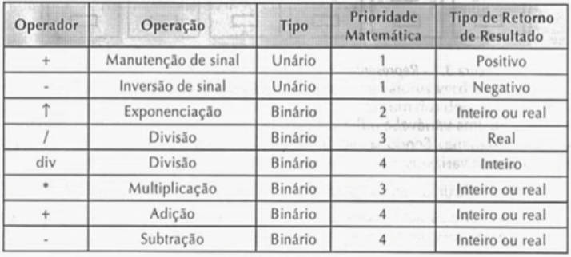

Instruções são **palavras-chave** (vocabulário) de uma determinada linguagem de programação que tem por finalidade comandar um computador que irá **tratar os dados**.

Nas linguagens de programação, assim como nas linguagens naturais, diferentes palavras são utilizadas para se referir ao mesmo objeto. As instruções primitivas, dentro de cada linguagem de programação possuem uma sintaxe particular, e essa notação também está relacionada aos operadores.

Outros conceitos importantes: **entrada**, **processamento** e **saída de dados**.

Os dados são **importados** de algum lugar (arquivo, diretório, entre outros), levados a um ambiente computacional para **processamento** e depois **impressos** em algum dispositivo de saída.

>Ex. Média escolar

```portugol
Início programa:
    Nota1 = 5
    Nota2 = 8

    Resultado = 0
    Resultado = (Nota1 + Nota2)/2
    
    Escreva resultado
Fim programa
Saída: 6.5
```

E se quisermos verificar se o aluno foi ou não aprovado?

#### 1.3.3 Estruturas Condicionais e Operadores

Condicional expressa uma condição ou suposição, contém ou implica uma suposição ou hipótese.

Dada uma condição que foi satisfeita, determinada operação é executada. Caso a condição não seja satisfeita, tem-se uma exceção.

A estrutura condicional pode ser:

Simples...

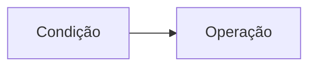

Composta...

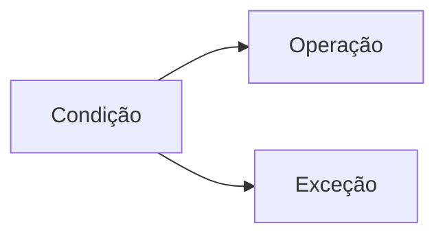

Encadeada...

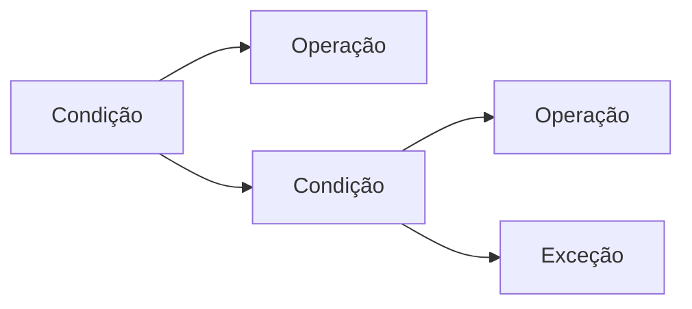

Os operadores relacionados a estrutura condicional são:

Símbolo | Significado
--------|------------
= | Igual a
<> | Diferente de
\> | maior que
< | menor que
\>= | maior ou igual a
<= | menor ou igual a

Na **condicional simples**, se a condição for cumprida, ocorre a operação.
Em uma estrutura mais próxima do portugol:

```portugol
Se (<condição>) então
    <instruções para condição verdadeira>
Fim_se
```

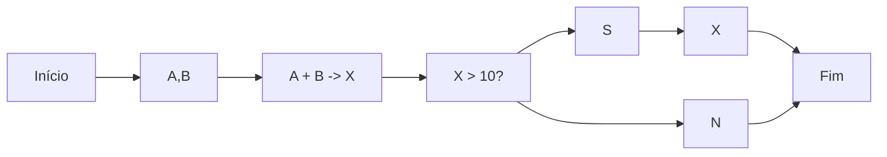

Na **condicional composta**, se a condição for cumprida, ocorre a operação, se não, ocorre a exceção.

```portugol
Se (<condição>) então
    <instruções para condição verdadeira>
Senão
    <instruções para condição falsa>
Fim_se
```

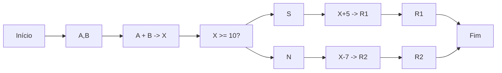

Na condicional encadeada, há uma sucessão de condições a serem cumpridas, com suas respectivas exceções.

```portugol
Se (<condição 1>) então
 <instruções para condição verdadeira>
Senão
 Se (<condição 2>) então
 <instruções para condição 2 verdadeira e condição 1 falsa>
Senão
<instruções para condição 1 e 2 falsas>
Fim_se
```

Os operadores lógicos são utilizados para verificar se uma condição é verdadeira ou falsa, de forma simplificada.

* AND (e): Todas as condições devem ser satisfeitas (Intercepto).
* OR (ou): Apenas uma das condições precisa ser satisfeita (União).
* NOT (não): É um operador de negação, que inverte o resultado lógico (o que é falso se tona verdadeiro, o que é verdadeiro se torna falso).

>Ex. not x -> tudo que não está em x

#### 1.3.4 Estrutura de repetição

Suponhamos que um pedaço do código precisa ser executado mais de uma vez, com diferentes valores em suas variáveis.

Temos, então, uma estrutura de repetição que irá executar determinado trecho de um programa a partir de certos parâmetros. Deve existir, no entanto, uma condição de parada, para que o looping não seja infinito.

Qual a vantagem de usar uma estrutura de repetição ao invés de simplesmente repetir o código?

* Redução de linhas;
* Compreensão facilitada;
* Redução de erro.

\+ eficiência!

Existem algumas estruturas utilizadas para repetições

ENQUANTO

* Teste lógico
  * Início
* Número de repetições
  * Indefinido

>Ex. Um homem corta a grama do seu jardim: Enquanto a grama estiver alta, aparar a grama

```portugol
grama = Falso
Enquanto (grama == falso) faça
    <instrução de cortar grama>
    <atualiza grama>
fim enquanto
```

PARA... DE... ATÉ

* Teste lógico
  * Início
* Número de repetições
  * Definido

```portugol
somatório = 0
para início = 1 até 10
    somatório = somatório + início
    escreva somatório
fim para
```

OBS: É possível mesclar as estruturas, ou seja, utilizar uma dentro da outra.

#### 1.3.5 Vetores e Matrizes

Um **vetor** é caracterizado por uma variável dimensionada com tamanho pré-fixado. Em termos prático, pode ser visto como um contêiner, ou uma matriz unidimensional.

Uma **matriz** é uma tabela organizada em linhas e colunas no formato m*n, em que m representa o número de linhas (horizontal) e n o número de colunas (vertical).

* É uma coleção de variáveis contíguas em memória, cuja identificação é feita pelos índices (m * n).

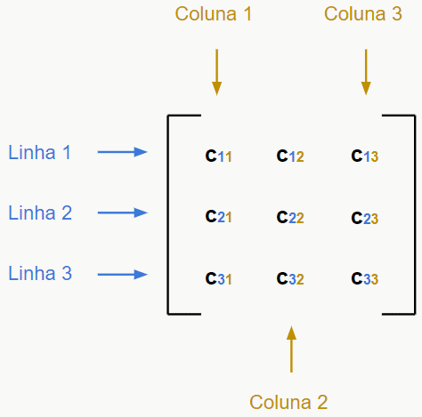

Uma forma de utilizar as matrizes seria para armazenar as notas de um aluno...

```logica
nota11 = 10
nota12 = 5
nota21 = 7
nota22 = 8

Com matrizes:
notas_aluno1 = [10,5]
notas_aluno2 = [7,8]
```

Definição:

* vetor conjunto [1...15] <inteiro>
* vetor [15]
* vetor = []

#### 1.3.6 O que são funções?

É similar ao conceito de função da matemática, ou seja:

As **funções**, ou **sub rotinas**, são blocos de instruções que realizam tarefas específicas.

* São trechos de código que realizam tarefas específicas e podem ser chamados dentro do código.

A modularização de um programa permite que o código fique mais claro e conciso, além de poder ser **reutilizado**.

Assim, na computação, funções podem ser definidas como blocos de instruções (códigos), identificados por nomes e parâmetros.

Aplicando funções para determinar a média escolar (exemplo utilizado na aula "1.3.5 Vetores e Matrizes"):

```logica
função mediaescolar(nota1,nota2)
    resultado = 0
    resultado = (nota1 + nota 2)/2
fim função
aluno1 = mediaescolar(nota11,nota12)
aluno2 = mediaescolar(nota21, nota22)
```

#### 1.3.7 Instruções de entrada/saída

**Instruções de entrada** consistem na inserção e recebimento de dados do mundo real por meio de ação de alguma interface (teclado, mouse, arquivos, entre outros).

**Instruções de saída** consistem na impressão dos dados do mundo abstrato, digita, por meio de ação de alguma interface. Os formatos podem variar desde simples arquivos binários até complexas querys de banco de dados.

Existem dois tipos de saída em um programa:

* Saída programada;
  * Condicional
  * Incondicional
* Saída por interrupção (geralmente é definida pelos periféricos).

Uma saída pode ser:

* Bem sucedida;
* Erro de sintaxe ou outro;
* Erros de programação;
* Problema com a interface.

---

### 1.4 Linguagens de Programação

O objetivo desta aula é apresentar os paradigmas de programação existentes, incluindo o conceito em si. As linguagens de programação são baseadas em um ou mais paradigmas, sendo o último caso conhecido como linguagem multiparadigma.

* Etapa 1 - Introdução à linguagem de programação
* Etapa 2 - Como um computador entende o programa
* Etapa 3 - Características de um programa
* Etapa 4 - Análises e Código
* Etapa 5 - Paradigmas de Programação

#### 1.4.1 Introdução a linguagens de programação

Problemas computacionais são recorrentes, e objeto de discussão que possui instruções passo a passo que são mais facilmente resolvíveis em ambiente computacional.

Os problemas podem ser de decisão, busca, otimização e evoluem com o passar do tempo e surgimento de novas tecnologias.

* Problemas de **decisão** tem caráter lógico (sim x não), e tem a ideia de pertencimento (Ex. Dado um número n inteiro positivo, determine se n é primo ou não).
* Problemas de **busca** tem relacionamento binário, o objetivo é determinar se X está em A (Ex. clique – há três nós conectados entre si?)
* Problemas de **otimização** buscam maximizar (ou minimizar) uma função.

Diante do que foi apresentado, podemos dizer que uma linguagem de programação é um método padronizado, composto por um conjunto de regras sintáticas e semânticas de implementação de um **código fonte**.

#### 1.4.2 Como um computador entende o programa?

Um código fonte é gerado a partir da programação em alto nível (Java, C#...), ele será, então, traduzido ou interpretado.

* Se não for possível que o computador o entenda, um programa é apenas um amontoado de palavras.

Como fazer?

A linguagem de alto nível (**programa fonte**) é enviada ao compilador, que executa a análise do programa e o traduz para uma linguagem de baixo nível (**programa objeto**), que a máquina entenda.

O processo de tradução (1) gera um programa objeto e (2) executa o programa objeto, o que garante execução mais rápida e programas menores. O processo de interpretação, por sua vez, é definido pela execução direta do programa fonte, garantindo maior flexibilidade.

#### 1.4.3 Características de um programa

Existem algumas diretrizes cuja boa prática é levar em consideração na hora de programas:

* Legibilidade, a facilidade de leitura
  * Compreensão;
  * Ortogonalidade (coerência nas instruções);
  * Definição adequada das estruturas.

* Redigibilidade, a facilidade de escrita
  * Ortogonalidade;
  * Simplicidade;
  * Suporte à abstração;
  * Reuso;
  * Expressividade.

* Confiabilidade, o programa faz o que foi programado para fazer
  * Verificação de tipos;
  * Trata exceções;
  * Uso de ponteiros;
  * Compatibilidade entre compiladores.

* Custo.

Outras características que podem ser levadas em consideração são atualizações, uso para IA, disponibilidade de ferramentas, comunidade ativa e adoção pelo mercado.

#### 1.4.4 Análises de Código

Existem três tipo de análise realizadas pelo compilador do código:

* Léxica;
* Sintáxica;
* Semântica.

A **análise léxica**, também conhecida como scanner ou leitura, tem como função fazer a leitura do programa fonte, caractere por caractere, agrupando os elementos (identificadores, palavras reservadas, números, strings, entre outros) em tokens.

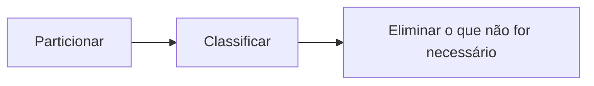

A **análise sintática** remete a forma, e depende da linguagem de programação utilizada.

A **análise semântica** remete ao significado, ou seja, à lógica do programa. Incide sobre a relação entre os significantes, como palavras, frases, sinais e símbolos.

```exemplo(js)
If (x = 0)
    printf(“O valor é nulo\n”);
```

No exemplo de código acima não há erro de sintaxe, mas o programa não faz aquilo que é esperado. Nesse caso, o problema está em if (x = 0).

= é um sinal de atribuição, e não comparação. A forma correta seria:

```exemplo(js)
If (x == 0)
    printf(“O valor é nulo\n”);
```

#### 1.4.5 Paradigmas da Programação

Um paradigma é a forma de resolução de problemas com diretrizes e limitações específicas de cada paradigma utilizando linguagem de programação.

Os paradigmas da programação podem ser classificados em:

* Orientação a Objeto (POO)
* Estruturado (PE)
  * Estrutura de blocos aninhados
* Procedural
  * Chamadas sucessivas e procedimentos separados
* Funcional
  * Instruções baseadas em funções
* Computação Distribuída
  * Funções executadas de forma independente
* Lógico

Um **paradigma estruturado** contém a ideia de sequência, decisão e iteração. A ênfase está em instruções executadas em sequência.

* É o foco de linguagens como o C, eficiente em problemas simples e diretos e para o aprendizado da programação.

O **paradigma de programação** orientada a objeto se baseia na utilização de objetos e suas interações, de forma análoga ao mundo real.

* E o que é um objeto?

É descrito por características específicas (**atributos**), comportamento (**métodos**) e **estado**.

>Ex. Caneta

O que tenho (atributos) | O que sou capaz de fazer (métodos) | Como faço (estados)
---|---|---
Modelo, cor, carga, corpo, tampa | Escrever, pintar, desenhar, rabiscar, destampar | Tampada, detampada, em uso

No **POO** (programação orientada a objetos) uma classe é alocada em memória, e possui operações associadas (métodos).

```logica
Classe caneta():
  cor: inteiro
  carga: caracter
  tampada: lógico
 
  metodo escreve()
    Se estado tampada
      Escreve (“Destampar”)
    Senão
      Escreva (“Algo”)
    Fimse
 
  método tampar()
    Tampada = verdadeiro

fimclasse
```

Os pilares da **POO** são:

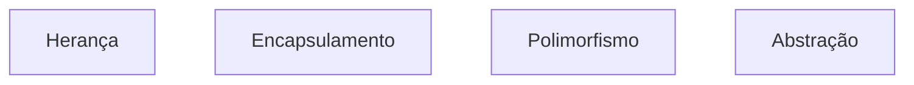

A POO é focada em reuso do código, enquanto a PE foca em problemas específicos e diretos.

---

### 1.5 Primeiro contato com a Programação

#### 1.5.1 Algoritmos em portugol

Portugol é uma pseudolinguagem de código, utilzada para estrutuar algoritmos. A linguagem se aproxima muito da natural, então é uma ótima ferramenta para começar a treinar a programação.

O **[Portugol Studio](https://portugol-webstudio.cubos.io/ide)** é uma ferramenta online para codificação em portugol.

>Resolvendo a questão da aula "1.1.8 Soma de Intervalos" em portugol

```portugol
programa {

  function inicio() {

    inteiro x, y

    escreva (“Digite os números para executar a soma dos valores”)
    leia(x)
    leia(y)

    escreva(soma_intervalo(x,y))
  }

    function inteiro soma_intervalo(inteiro x, inteiro y) {
    inteiro total, resultado_parcial
    total = y/2
    resultado_parcial = y * x

    inteiro resultado = total * resultado_parcial
    retorne resultado
  }

}
```

>Média dos alunos em portugol

```portugol
programa {

  funcao inicio() {

    real a1, a2, b1, b2

    escreva ("Adicione as notas do aluno A ")
    leia(a1,a2)
    escreva ("Adicione as notas do aluno B ")
    leia(b1,b2)

    escreva ("Média do aluno A: ", media_aluno(a1,a2))
    escreva ("\nMédia do aluno B: ", media_aluno(b1,b2))
  }

  funcao real media_aluno(real a1, real a2) {
    retorne (a1 + a2)/2
  }

}
```

#### 1.5.2 Referências

---

As anotações aqui apresentadas foram desenvolvidas com base no Bootcamp "Geração Tech Unimed-BH", da plataforma de estudos **[DIO](https://web.dio.me/home)**.

---

Computional Thiking

* <https://www.cs.cmu.edu/~CompThink/resources/TheLinkWing.pdf>
* <https://ubiquity.acm.org/article.cfm?id=1922682>
* <https://www.youtube.com/watch?v=YVEUOHw3Qb8>
* <https://simplificandoredes.com/historia-da-computacao/>
* <https://simplificandoredes.com/pensamento-computacional/>

Padrões

* <https://www.cin.ufpe.br/~if114/Monografias/Reconhecimento/>
* <https://web.fe.up.pt/~jmsa/recpad/index.htm>
* <https://www.teses.usp.br/teses/disponiveis/18/18133/tde-10072006-002119/publico/Capitulo_2_mestrado.pdf>
* <http://www.vision.ime.usp.br/~teo/publications/dissertacao/node9.html>
* <https://periodicos.furg.br/vetor/article/view/3363/3811>

Programação e algoritmos

* <http://www.inf.ufes.br/~tavares/labcomp2000/aulas.htm>
* <https://www.dca.fee.unicamp.br/cursos/EA876/apostila/HTML/>
* <http://www.inf.ufes.br/~tavares/labcomp2000/aula1.htm>

Algoritmos

Livro: Fundamentos da programação de computadores – Pearson
<https://www.youtube.com/watch?v=HtSuA80QTyo&list=PLUl4u3cNGP61Oq3tWYp6V_F-5jb5L2iHb>

Gerais

* José Augusto Manzano, Algoritmos - lógica para desenvolvimento de programação de computadores, Ed. Érica, 17a ed. (ou mais recentre) - livro de referência
* Ana Fernandes Ascencio, Fundamentos da programação de computadores - algoritmos, Pascal, C/C e Java, Ed. Pearson, 2a ed.
* Andrew S. Tanenbaum, “Livro Organização Estruturada de Computadores”, Ed. Pearson, 5a edição -- Capítulo 1
* The Formal Semantics of Programming Languages, Glynn Winskel Deitel e Deitel, “C++ How to Program”, 5th edition, Editora Prentice Hall, 2005 -- Capítulo 1
* Waldemar Celes, Renato Cerqueira e José Lucas Rangel, "Introdução a Estrutura de Dados com Técnica de Programação em C", Editora Campus-Elsevier, 2004 -- Capítulo 1
