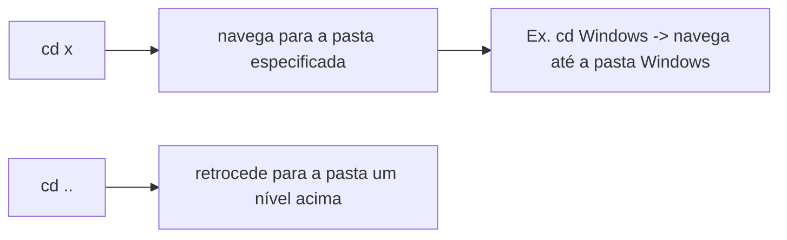
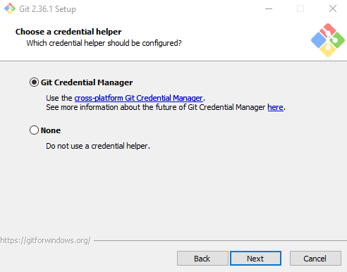
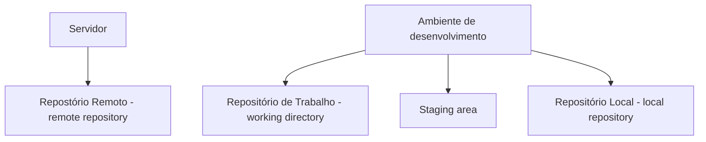
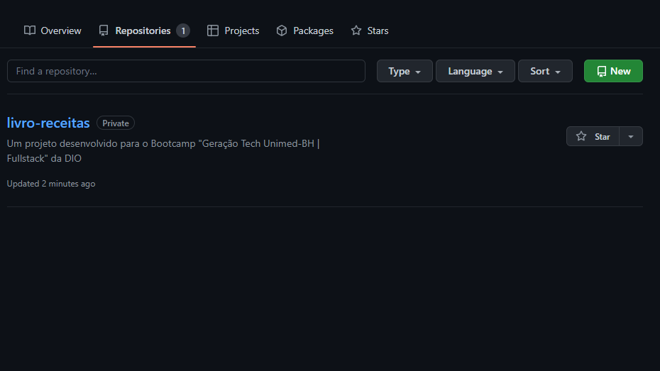
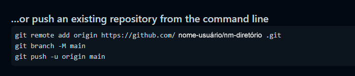

# Módulo 1 - Princípios de Desenvolvimento de Software

As anotações aqui apresentadas foram desenvolvidas com base no Bootcamp "Geração Tech Unimed-BH", da plataforma de estudos **[DIO](https://web.dio.me/home)**.

## Curso 2 - Introdução ao Git e ao GitHub

//Primeiros passos no Git e no GitHub

**Mentor: Otávio Reis**

---

[2.1 Entendendo o Git e sua importância](#21-entendendo-o-git-e-sua-importância)

[2.2 Navegação via command line e instalação](#22-navegação-via-command-line-e-instalação)

[2.3 Entendendo como o Git funciona por baixo dos panos](#23-entendendo-como-o-git-funciona-por-baixo-dos-panos)

[2.4 Primeiros comandos em Git](#24-primeiros-comandos-em-git)

[2.5 Ciclo de Vida dos arquivos no Git](#25-ciclo-de-vida-dos-arquivos-no-git)

[2.6 Introdução ao GitHub](#26-introdução-ao-github)

[2.7 Resolvendo Conflitos](#27-resolvendo-conflitos)

---

### 2.1 Entendendo o Git e sua importância

Por quê?

Imagine que um jornalista tenha que escrever um artigo. Ele escreve a primeira versão (rascunho1) e envia ao revisor. O revisor retorna o arquivo com sugestões de mudanças a partir das quais o jornalista cria uma segunda versão do artigo (rascunho2). Essa nova versão é enviada ao revisor, novamente, que sugere mais uma série de modificações. A partir dessas novas sugestões, o jornalista escreve o rascunho_final, que é enviado ao redator para aprovação.

Há pelo menos 3 versões desse artigo, diferentes entre si. Se este é um problema na área do jornalismo, imagine na programação...

O Git é um sistema de versionamento de código distribuído, criado por Linus Torvalds em 2005.

* Ajuda a criar e monitorar diferentes versões de um código.

Linus é o criador do sistema operacional Linux, que foi desenvolvido a partir da colaboração de programadores em todo o mundo. Era preciso criar um software que criasse versões do programa (assim como no caso do jornalista, que precisa escrever um artigo) potente o suficiente para suportar as várias alterações dos colaboradores ao redor do mundo. A partir daí, nasceu o Git.

Ao longo do tempo, outras empresas surgiram para solucionar essa demanda, por exemplo o Git Hub, uma empresa da Microsoft muito bem estabelecida no mercado.

* Git e GitHub não são a mesma coisa, são tecnologia diferentes com respectivos produtos substitutos.

Para que aprender essas duas tecnologias?

* Controle de versão;
* Armazenamento em nuvem;
* Trabalho em equipe;
* Melhorar seu código;
* Reconhecimento

---

### 2.2 Navegação via command line e instalação

#### 2.2.1 Comandos básicos para um bom desempenho no terminal

A maior parte dos programas possui uma interface gráfica, com a qual podemos interagir, seja selecionando, clicando ou arrastando, o que recebe o nome de GUI (Graphic User Interface). O Git é um CLI (Comman Line Interface), cuja interação se dá por meio de linhas de comando.

O que iremos aprender?

* Mudar de pastas;
* Listar as pastas;
* Criar pastas/arquivos;
* Deletar pastas/arquivos.

>Os comandos possuem variantes, flags que modificam a forma com que os comandos são devolvidos.

OBS: os comandos são diferentes para sistemas operacionais Windows e Unix (Apple e Linux).

---

No Windows:

//No prompt de comando

Listar as pastas: **dir**

* Lista os diretórios na pasta em que estamos situados.

Mudar as pastas: **cd** (change directory)



Limpar a tela: **cls** (clear screen)

Criar uma pasta: **mkdir** (make directory)

Existe uma diferença entre deletar arquivos e deletar pastas.
O comando del apaga todos os arquivos dentro de uma pasta, e não a pasta em si.

Para remover a pasta (diretório) e, junto, todos os arquivos que estão dentro dela, utiliza-se o comando **rmdir** (remove directory) **\<nome do diretório> /S /Q**

---

No Linux:

//No prompt de comando

Listar as pastas: **ls**

* Lista os diretórios na pasta em que estamos situados.

Mudar as pastas: **cd** (change directory)

* Funciona da mesma forma que no Windows

Limpar a tela: **clear** (ctrl + L)

Criar uma pasta: **mkdir** (make directory)

Para deletar uma pasta utiliza-se o comando rm -rf

-rf são flags:

* r = recursive -> exclui todas as pastas internas;
* f = force -> não aparece janela de confirmação.

---

#### 2.2.2 Instalando o Git

Download em: <https://git-scm.com/>

No Windows:

* As opções **Git Bash here** e **Git GUI** here devem estar marcadas na seleção de componentes, na janela de instalação do programa.
* Na aba Choose a credential helper escolha a opção Git Credential Manager Core. (Na versão 2.36 a única opção é Git Credential manager, que já é multiplataforma).



---

### 2.3 Entendendo como o Git funciona por baixo dos panos

#### 2.3.1 Tópicos fundamentais para entender o funcionamento do Git

* SHA1;
* Objetos Fundamentais;
* Sitema distribuído;
* Segurança.

A SHA (Secure Hash Algorithm) é um conjunto de funções hash criptográficas projetadas pela NSA (Agência Nacional de Segurança dos EUA). Em suma, um algoritmo que criptografa coisas.

A encriptação gera um conjunto único de caracteres identificador de 40 dígitos, Uma forma curta de representar o estado de um arquivo.

Com o Git instalado, ao clicar com o botão direito em um diretório, aparece a opção Git Bash Here, que lança o Git bash para aquele diretório específico, o que facilita o processo, já que não é preciso navegar até dita pasta.

Suponha, então, que queremos encriptar um arquivo de texto (chamado Lorem) usando o SHA1:

```Git
    $ openssl sha1 Lorem.txt
        SHA1(Lorem.txt)= b6511d738c11c789cfcebe1fd52086585a0ea499

Se uma letra for alterada no arquivo:

    $ openssl sha1 Lorem.txt
        SHA1(Lorem.txt)= d9bf998c4e3f7d3fcab486c095c2919775520ca6

Se a letra for alterada novamente para a inicial:
    $ openssl sha1 Lorem.txt
        SHA1(Lorem.txt)= b6511d738c11c789cfcebe1fd52086585a0ea499
```

Perceba que da terceira vez os caracteres SHA gerados foram iguais aos da primeira vez. Logo, é muito fácil identificar se um arquivo sofreu modificação ou não.

#### 2.3.2 Objetos internos do Git

Os três tipos básicos de objeto no Git são:

* BLOBS
  * SHA1 do arquivo.
* TREES
  * Responsáveis pela estrutura dos arquivos.
  * Podem apontar para blobs ou outras árvores;
* SHA1 dos metadados da árvore.
* COMMITS
  * Dá coesão a alteração feita no arquivo, juntando as informações.
  * Apontam para uma árvore, um parente (o último commit realizado antes dele), um autor, uma mensagem e um timestamp.
* SHA1 dos metadados do commit.

Qualquer alteração em um blob será refletida nos objetos de níveis superiores. Por isso p Git é tão confiável, é possível montar uma linha do tempo dos commits realizados


Fonte: <https://git-scm.com/book/en/v2/Git-Branching-Branches-in-a-Nutshell>

O Git é um sistema distribuído e seguro porque tanto a versão em nuvem quanto a versão de cada um dos mantenedores do código são confiáveis.

---

### 2.4 Primeiros comandos em Git

#### 2.4.1 Iniciando o Git e criando um commit

* Iniciar o GIT;
  * **git init**
* Iniciar o versionamento;
  * **git add**
* Criar um commit
  * **git commit**

```Git
    $ mkdir workspace
> Cria uma pasta denominada “workspace”, dentro da qual trabalharemos.

    $ dir
> Lista as pastas no diretório C:

    $ cd workspace/ 
> Navega até a pasta criada que se chama “workspace”
    
    $ mkdir livro-receitas 
> Cria uma pasta denominada “livro-receitas”
    
    $ dir 
> Lista as pastas na pasta livro-receitas

    $ cd livro-receitas 
> Navega até a pasta “livro-receitas”

    $ git init

    $ dir -a 
> Lista as pastas no diretório  “livro-receitas”
> A flag “a” mostra também arquivos ocultos.
```

```Git
Para configurar o usuário do Git 
(OBS: use as mesmas informações do GitHub)

    $ git config --global user.email "seu@email.com"
    $ git config --global user.name "seu-usuário"
```

Depois de realizar os passos, adicione sua primeira receita na parta “livro-receitas“, um arquivo de texto com a extensão .md (markdown).

```Git
    $ git add *

    $ git commit -m "commit inicial" 
> Cria o commit com a descrição entre aspas e retorna informações sobre o commit
```

---

### 2.5 Ciclo de Vida dos arquivos no Git

#### 2.5.1 Passo a passo no ciclo de vida

git init é um comando cria um repositório dentro da pasta desejada.

Para entender do que se trata, é preciso compreender os conceitos de **tracked** e **untracked**.

* Não temos ciência dos arquivos untracked e temos do tracked.


Fonte: <https://git-scm.com/book/en/v2/Git-Basics-Recording-Changes-to-the-Repository>

Em **unmodified** ficam os arquivos que ainda não foram modificados e, intuitivamente, em **modified** ficam os arquivos que já foram modificados.

O **staged** é como um palco, em que alguém se prepara para apresentar ou, nesse caso, um arquivo se prepara para fazer parte de outro agrupamento, um **commit**.

Commit retorna os arquivos para o estágio unmodified, criando uma “screenshot” do código naquele momento.

Esses passos foram executados na aula “2.4.1 Iniciando o Git e criando um commit”:

1. Ao criar o arquivo da primeira receita (no meu caso, strogonoff), ele ainda estava untracked.
2. Ao executar o comando git add, o arquivo foi movido de untracked direto para staged.

A transição de unmodified para modified ocorre, como sugere o diagrama acima, quando um arquivo sofre alguma alteração. O Git sabe disso ao comparar as SHA1 das duas versões.

A transição de modified para staged ocorre da mesma maneira que de untracked direto para staged, através do comando git add.

O que é um repositório?

Considere 2 ambientes: ambiente de desenvolvimento (representado pela máquina do usuário) e o servidor (usaremos o GitHub).

As alterações feitas na máquina não repercutem imediatamente no servidor.



Os arquivos transitam entre working directory e staging area à medida que são utilizados e modificados, mas, ao criar um commit, integra-se o repositório local. Este, por sua vez, pode ser empurrado para o repositório remoto.

>Importante:
>git status é o comando que mostra o estado dos arquivos.

Na prática:
>Primeiro navegue até a pasta “livro-receitas”!

```Git
    $ git status
> Retorna os status dos arquivos dentro da pasta 
Partindo de onde a aula anterior parou:
    
    $ mkdir receitas
> Cria uma pasta denominada “receitas”

    $ mv Strogonoff.md ./receitas/
> Move o arquivo Strogonoff.md para a pasta “receitas”
    
    $ git status
    On branch main
    Changes not staged for commit:
        (use "git add/rm <file>..." to update what will be committed)
        (use "git restore <file>..." to discard changes in working directory)
            deleted:    Strogonoff.md
    Untracked files:
        (use "git add <file>..." to include in what will be committed)
            receitas/
    no changes added to commit (use "git add" and/or "git commit -a")
> Em suma, o Git entende que o arquivo Strogonoff foi excluído pois foi movido para uma pasta não monitorada (receitas).
    
    $ git add Strogonoff.md receitas
> Adiciona os arquivos especificados ao Git, e agora estão sendo monitorados.
    
    $ git status
    On branch main
    Changes to be committed:
        (use "git restore --staged <file>..." to unstage)
            renamed:    Strogonoff.md -> receitas/Strogonoff.md
> O Git reconheceu as mudanças e sugere a criação de um commit.
    
    $ git commit -m "cria pasta receitas, move Strogonoff.md para receitas"
> Cria o commit com a descrição entre aspas.
> Retorna informações sobre o commit.
```

Agora vamos adicionar um index ao livro de receitas.

```Git
    $ echo >README.md
> Exporta texto para um arquivo, nesse caso, do tipo markdown (.md)
    
    $ git status
    On branch main
    Untracked files:
        (use "git add <file>..." to include in what will be committed)
            README.md
        nothing added to commit but untracked files present (use "git add" to track)

    $ git add *
> Adiciona todos os arquivos ao Git

    $ git commit -m "adiciona index"
> Cria o commit com a descrição entre aspas
> Retorna informações sobre o commit.
```

---

### 2.6 Introdução ao GitHub

O primeiro passo, claro, é criar uma conta no GitHub.

>OBS: É interessante que o e-mail e usuário do Git sejam iguais aos do GitHub.

#### 2.6.1 Chave SSH e Token (no curso, 2.3.3)

SSH, a grosso modo, é uma forma de estabelecer uma conexão segura e encriptada entre duas máquinas. No caso do curso, a conexão é com o servidor do GitHub, por meio de duas chaves (uma pública e uma privada). Por meio da chave pública, o GitHub se familiariza com a máquina do usuário, que será capaz de enviar seus códigos sem precisar de senha.

Para gerar as chaves no Gitbash:

```Git
    $ ssh-keygen -t ed25519 -C seu@email.com
> Gera as chaves pública e privada em um diretório
> A chave pública é para colocada no seu perfil no GitHub.
    
    $ eval $(ssh-agent -s)
> Gera um agente responsável por lidar com as chaves.
   
    $ ssh-add id_ed25519
> Passa a chave privada para o agente.
```

A chave token é outra forma de realizar a autenticação no GitHub. É gerada no próprio site e deve ser copiada e armazenada em um local seguro.

#### 2.6.2 Trabalhando com o GitHHub

Para criar um novo repositório:




Após criado o repositório, ele está vazio, o código poderá ser desenvolvido das seguintes formas:

* Nas linhas de comando;
* Empurrar um repositório existente;
* Importar o código de outro repositório.

Utilizaremos a segunda opção.



>Navegue até a pasta “livro-receitas”, no Git!

```Git
    $ git remote add origin https://github.com/nome-usuário/nm-repositório.git
> Adiciona a origem remota do repositório, e “origin” é um apelido de convenção para facilitar o processo.

    $ git remote -v
> Lista as listas de repositório remoto cadastradas
origin  https://github.com/nome-usuário/nm-repositório.git (fetch)
origin  https://github.com/nome-usuário/nm-repositório.git (push)
    
    $ git push origin main
> Empurra o repositório da máquina para a página online. 
Muito provavelmente vai pedir para liberar o acesso.
```

A página do repositório no GitHub será atualizada.

---

### 2.7 Resolvendo Conflitos

#### 2.7.1 Como os conflitos acontecem no GitHub

O **conflito de Merge** ocorre quando o GitHub tenta juntar dois arquivos e existem alterações na mesma linha.

Suponha que um repositório está na sua máquina e no GitHub. Alguém faz um clone do repositório para fazer uma contribuição. Em um primeiro momento, ninguém mexeu no código, então os dois repositórios (na sua máquina e na do contribuinte) estão sincronizados.

Entretanto, o contribuinte realiza uma alteração no repositório, na mesma linha que você alterou. O código na sua máquina é um, na máquina do contribuinte é outro e no GitHub também é outro. O contribuinte, então, realiza o upload pro GitHub. Isso faz com que o seu código fique desatualizado.

Se você tentar fazer o upload da sua versão, o Github retorna exatamente esse aviso. Ocorre, então, o conflito de merge, que deve ser resolvido manualmente.

```Git
    $ git push origin main
> Caso ocorra o problema citado, o Git retorna uma mensagem de erro.
    
    $ git pull origin main
> Puxa o repositório da página online para a máquina.
```

As duas versões devem ser integradas para que seja possível executar o comando push. E como fazer isso? Através do commit.Mas, primeiro, abra os arquivos e salve as alterações desejadas.

```Git
    $ git add *
> Adiciona todos os arquivos ao Git
    
    $ git commit -m “resolução de conflitos”
>  Cria o commit com a descrição entre aspas e retorna informações sobre o commit.

    $ git push origin main
> Empurra o repositório da máquina para a página online.
```

```Git
Observação:

    $ git clone https://github.com/urldesejada.git
> Para clonar um repositório do GitHub, ou seja, não faz download apenas 
da pasta (já vem com a pasta .git dentro)
```

#### Referências

---

As anotações aqui apresentadas foram desenvolvidas com base no Bootcamp "Geração Tech Unimed-BH", da plataforma de estudos **[DIO](https://web.dio.me/home)**.

---
