# Módulo 2 - Fundamentos web com HTML e CSS

As anotações aqui apresentadas foram desenvolvidas com base no Bootcamp "Geração Tech Unimed-BH", da plataforma de estudos **[DIO](https://web.dio.me/home)**.

## Curso 3 - Posicionando elementos com Flexbox em CSS

//Primeiros passos para começar a programar

**Mentora: Karen Santos**

---

[3.1 Introdução do curso](#31-introdução-do-curso)

[3.2 Fundamentos do Flexbox - Parte 1: Flex Container](#32-fundamentos-do-flexbox---parte-1-flex-container)

[2.3 Fundamentos do Flexbos - Parte 2: Flex Items](#33-fundamentos-do-flexbox---parte-2-flex-itens)

---

### 3.1 Introdução do curso

#### 3.1.1 Introdução do curso

Objetivo:

Apresentar os fundamentos e aplicações da propriedade flexbox na criação de layouts responsivos, sem a necessidade da definição de valores fixos. Ou seja, criar páginas que se adaptam a diferentes resoluções.

* Aula 1: Introdução ao Flexbox;
* Aula 2: Fundamenos do Flexbox;
* Aula 3: Projeto Integrador.

#### 3.1.2 Proposta de Projeto Final

O projeto desenvolvido ao longo do curso foi uma página web responsiva para uma empresa de turismo fictícia.

A minha versão pode ser encontrada aqui: **[Projeto Flexbox](https://github.com/cla-isse/projeto-Flexbox-GTUBH.git)**

#### 3.1.3 Introdução ao Flexbox

O flexbox foi pensado como um modelo de layout unidimensional, um método que pode oferecer distribuição de espaço entre itens em uma interface e recursos de alinhamento.

**Flex Container** é a tag que envolve os itens, que contém os demais itens.

Para transformar uma tag comum em **flex container**, é aplicada a tag **“display: flex”**, o que também transforma todos os itens filhos em flex itens.

Um flex container possui propriedades relacionadas, tais como:

* Display;
* Flex-direction;
* Flex-wrap;
* Flex-flow;
* Justify-content;
* Align-items;
* Align-content.

Flex Item é o nome dado aos filhos diretos do Flex Container, e também podem se tornar Flex Containers.

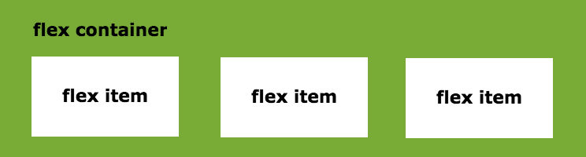

Flex itens também possuem propriedades relacionadas, são elas:

* Flex-grow;
* Flax-basis;
* Flex-shrink;
* Flex;
* Order;
* Align-self.

### 3.2 Fundamentos do Flexbox - Parte 1: Flex Container

#### 3.2.1 Estrutura básica do display flex

O comando **display:flex;** torna a tag um elemento do tipo flex container, e, assim todos os filhos diretos dessa tag automaticamente se tornam flex items.

>Todas as tags em HTML podem se tornar flex container.

```html
<!DOCTYPE html>
<html lang="en">
<head>
    <meta charset="UTF-8">
    <meta http-equiv="X-UA-Compatible" content="IE=edge">
    <meta name="viewport" content="width=device-width, initial-scale=1.0">
    <title>Fundamentos - Display:flex</title>
    <style>
        .flex {
            max-width: 300px;
            padding: 10px;
            border: 2px solid black;
            display: flex; /* com essa tag, cada item passa a ocupar o máximo de conteúdo, se abrigando dentro da tag flex */
            /* podem ser acrescentados mais itens, mas em dado momento os itens começarão a vazar (tente adicionar mais div para testar) */
        }
        .item {
            background-color: #79ac36;
            margin: 5px;
        } /* aplicada aos filhos do container. (.flex) já funciona para os cotainers, resta fazer uma estilização mínima nos itens nele contidos. */
    </style>
</head>
<body>
    <div class="flex">
        <div class="item">Item 1</div>
        <div class="item">Item 2</div>
        <div class="item">Item 3</div>
    </div>
</body>
</html>
```

O código anterior é exibido da seguinte maneira:


A borda preta demarca o **flex container**. Dentro dele, estão os **flex itens**, coloridos de verde e sem nenhuma condição especial.

>Dica: é possível criar tags, no VS Code utilizando o comando: tipo-da-tag.classe-da-tag*x

#### 3.2.2 Estrutura básica do flex direction

**Flex-direction** é a propriedade que estabelece o eixo principal do container, ou seja, a direção em que os flex items são colocados no flex container.

* row (padrão): a direção do texto, esquerda para direita;


* row-reverse: sentido oposto à direção do texto, direita para esquerda;


* column: ordenação de cima para baixo (inicialmente com uma única coluna);

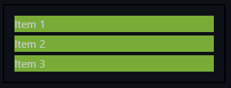

* column-reverse: ordenação inversa, de baixo para cima.

#### 3.2.3 Estrutura básica do flex wrap

**Flex-wrap** é a propriedade que define se os itens devem ou não quebrar a linha a medida que mais deles forem acrescentados.
Por padrão, não ocorre a quebra de linhas, o que faz com que os flex itens sejam compactados no limite do seu conteúdo, até que não seja mais possível e eles ultrapassem o container.


* **Wrap** permite a quebra de linha assim que um dos flex itens não puder mais ser compactado;

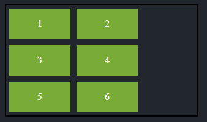

* **Wrap-reverse** permite a quebra de linha assim que um dos flex não puder mais ser compactado, porém na direção contrária , de baixo para cima.

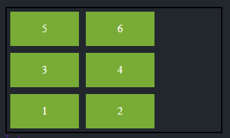

#### 3.2.4 Estrutura básica com flex flow

O flex flow é um atalho para as propriedades flex-direction e flex-wrap.

Seu uso não é tão comum, visto que, quando mudamos o flex-direction para column, mantem-se o padrão do flex-wrap, que é o nowrap.

```html
…
<style>
…
    .default {
        flex-flow: row nowrap;
    }

    .wrap {
        flex-flow: row wrap; /* é possível fazer várias combinações dessas duas propriedades*/
    }

    .wrap-reverse {
        flex-flow: row wrap-reverse;
    }

    .column-nowrap {
        flex-flow: column nowrap;
    }
</style>
...
```

Flex flow: Default - row x nowrap

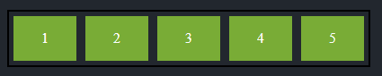

Flex flow: row x wrap

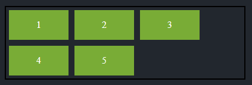

Flex flow: row x wrap-reverse

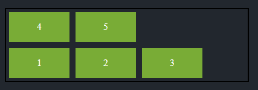

Flex flow: column x nowrap

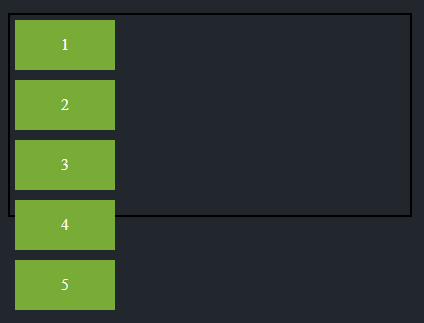

E assim por diante...

#### 3.2.5 Estrtutura básica do justify content

Essa propriedade trata do alinhamento dos itens dentro do container, de acordo com a direção pretendida (row ou column).

>Trata, a príncipio, do alinhamento horizontal. Também se aplica a elementos em coluna, mas o que antes era direita passa a ser “para cima” e o que antes era esquerda passa a ser “para baixo”.

* Flex-start: Alinha com o início do container;

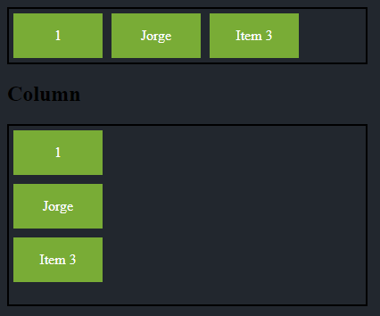

* Flex-end: Alinha com o final do container;

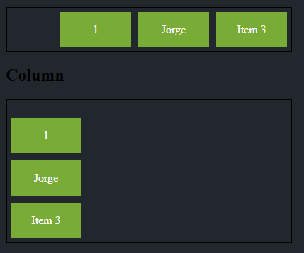

* Center: Alinha no centro do container;

* Space-between: cria um espaçamento igual entre os elementos (alinhamento justificado);

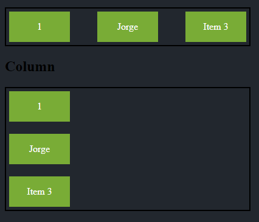

* Space-around: os espaçamentos do meio são duas vezes maiores que o inicial e final.

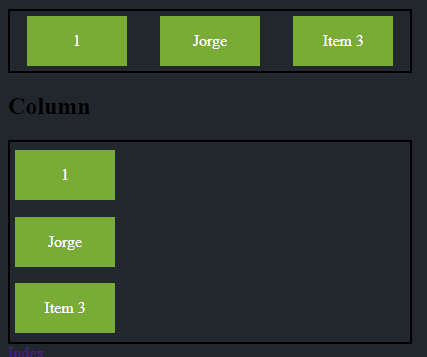

#### 3.2.5 Estrutura básica com align items

Trata do alinhamento dos flex itens de acordo com o eixo vertical do container, e, assim como o justify items, é diferente quando no tratamento de eixos em comparação ao de colunas.

* Center: alinhamento dos itens ao centro;
* Stretch: padrão. Flex itens crescem igualmente;
* Flex-start: alinhamento dos itens no início;
* Flex-end: alinhamento dos itens no final;
* Baseline: alinhamento de acordo com a linha base da tipografia dos itens.

#### 3.2.6 Estrutura básica com align content

É a propriedade responsável por tratar do alinhamento das linhas do container em relação ao eixo vertical do container.
É preciso que:

* O container utilize quebra de linhas;
* A altura do container seja maior que a soma das linhas dos itens.

Tipos de alinhamento

* Flex-start: Alinha com o início do container;
* Flex-end: Alinha com o final do container;
* Center: Alinha no centro do container;
* Space-between: cria um espaçamento igual entre os elementos (alinhamento justificado);
* Space-around: os espaçamentos do meio são duas vezes maiores que o inicial e final.

É uma mescla dos conceitos estudados em “align itens” e “justify content”

---

### 3.3 Fundamentos do Flexbox - parte 2: Flex Itens

#### 3.3.1 Estrutura básica com flex grow

É a propriedade que define a proporcionalidade de crescimento dos itens, respeitando o tamanho de seus conteúdos internos.

>OBS: Não irá funcionar caso seja adicionado justify-content ao flex container.

```html
…
<style>
    .fg0 {
        flex-grow: 0; /* padrão flex */
    }
    .fg1 {
        flex-grow: 1;
    }
    .fg2 {
        flex-grow: 2;
    }   
 </style>
…
```

Com **flex grow = 0**, os flex itens vão ocupar o mínimo possível do container, respeitando seu conteúdo interno.

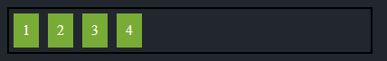

Se todos os flex itens tiverem **flex grow = 1**, ocuparão igualmente o maior espaço possível respeitando o container.


Se os flex itens tiverem valores de **flex grow** diferentes, respeitarão a proporção estabelecida, nos limites do container.

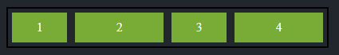

>No exemplo acima, o item (2) e o item (4) têm fg = 2, enquanto os itens (1) e (3) têm fg = 1. 
>
>Isso que dizer que os itens (2) e (4) ocupam o dobro de espaço que os itens (1) e (3).

#### 3.3.2 Estrutura básica com flexis basis

É a propriedade que estabelece o tamanho inicial dos itens antes da distribuição de espaço restante dentro dele, usando como base o conteúdo interno disposto.

Trata do tamanho mínimo dos itens dentro de um flex-container.
Os valores possíveis são:

* Auto: caso o item não tenha tamanho, este será proporcional ao conteúdo do item.


* Px, %, em, ...: são valores exatos previamente definidos;

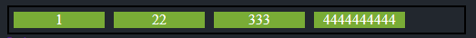

* 0: Terá relação com a definição do flex grow, priorizando manter os flex itens com tamanho constante.


#### 3.3.3 Estrutura básica com flex shrink

É a propriedade que estabelece a capacidade de redução ou compressão do tamanho de um item.

```html
...
<style>
    .shrink1 {
        flex-shrink: 1;
    }

    .shrink0 {
        flex-shrink: 0; /* não permite a diminuição do flex item, precisa ser acompanhado do flex basis */
        flex-basis: 100px;
    }
</style>
...
```

Shrink 1:

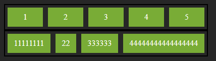

Shrink 0:


#### 3.3.4 Estrutura básica com flex

Flex é a propriedade de atalho (ou abreviação) para as propriedades grow, shrink e basis (nessa ordem).

>flex 1 0 auto = flex grow 1 + flex shrink 0 + basis auto

#### 3.3.5 Estrutura básica com order

Trata da ordem dos elementos, e, por padrão, é igual a 0.

Para que os elementos possam ser ordenados (de maneira diferente da forma como foi escrito no conteúdo HTML) todos eles precisam receber uma ordem.

```html
...
<style>
    .order1 {
        order: 1;
    }
    .order2 {
        order: 2;
    }
    .order3 {
        order: 3;
    }
</style>
...
```


#### 3.2.6 Estrutura básica do align self

Estabelece o alinhamento de modo individual sobre um cada item.

Os valores possíveis para a propriedade são:

* Auto: valor padrão, respeitará a definição de align-item do container;
* Flex-start: ao início do container;
* Flex-end: ao final do container;
* Center: relativo ao centro de acordo com o eixo;
* Stretch: ocupa todo o espaço relativo.

```html
...
<style>

    .center {
        align-self: center;
    }

    .flex-end {
        align-self: flex-end;
    }

    .baseline {
        align-self: baseline;
    }

    .stretch {
         align-self: stretch;
    }

</style>
...
```

Center: Todos os elementos alinhados no centro.

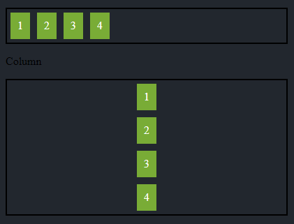

Misturado: Cada elemento com um alinhamento diferente

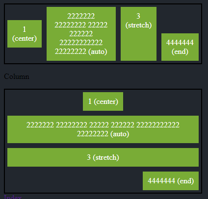

### Referências

---

As anotações aqui apresentadas foram desenvolvidas com base no Bootcamp "Geração Tech Unimed-BH", da plataforma de estudos **[DIO](https://web.dio.me/home)**.

---